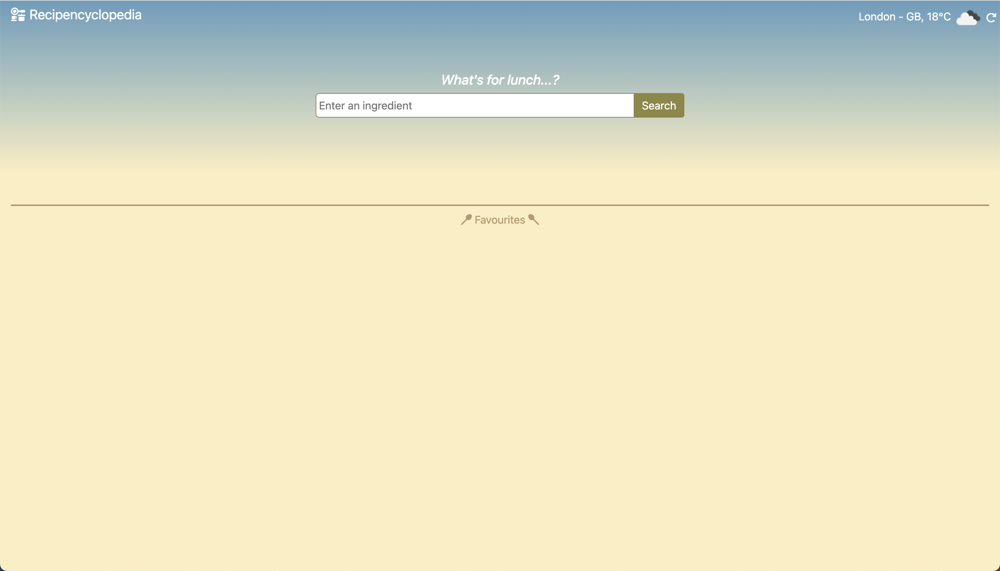

# Recipencyclopedia - Look up recipes using one ingredient

  

 

## Table of Contents
* [Description](#description)
* [Features](#features)
* [Installation & Deployment](#installation-and-deployment)
* [How to Use](#how-to-use)
* [License](#license)

 

 

## Description

This project presents a real-world situation in which the newfound JavaScript skills will come in handy. The code has been built to help users to look up recipes using a single ingredient, which will help reduce food waste in the current climate and help in the rising costs of living. 

 

 
 

## Features

### Recipe search

There is a search bar which allows the user to input an ingredient which returns a grid of recipes. These cards are clickable and displays the recipe name, region, image, ingredients and instructions.

 

 

### Store favourite recipes

Favourite recipes can be stored in the users local storage using the heart button in the recipe display. These recipe images are displayed in the footer of the page for easy access. These images are clickable and will display the recipe.

If the recipe is favourited, the heart button will appear as a solid heart.

To unfavourite the recipe, click the heart button again and the recipe will be removed from local storage. The heart button will appear as a heart with an outline.

 

 

### Store location

Users can store their location in local storage which displays their current temperature and weather. This can support the user in making a decision in recipe selection.

 

 

### Breakfast, lunch or dinner?

The greeting message is dynamic and will display breakfast, lunch or dinner depending on the users local time.

 

 

 

### APIs

[TheMealDB](https://themealdb.com/api.php) API has been used in this application to search for and display recipes using one ingredient term. It is also used to dynamically display the recipe card.

[OpenWeather](https://openweathermap.org/api) API has been used in this application to display the local weather conditions as entered by the user.

[Moment.js](https://momentjs.com/) API has been used in this application to greet the user with breakfast, lunch or dinner depending on the local time.

 

 

### Responsive and interactive UI

I have used [Bootstrap](https://getbootstrap.com/) in this project to provide responsive UI according to screen width. I have also used modals to display my recipe cards for a more interactive UI.

 

## Installation and Deployment

Installation not required, since this is a "plug and play" type of application. The user can simply run it locally by clicking on the `index.html` file and opening in either their default or preferred browser.

Application and presentation video can also be accessed at following links:
* [GitHub repository](https://github.com/mmyleung/P1-Recipencyclopedia).
* [Deployed application](https://mmyleung.github.io/P1-Recipencyclopedia).

 
 

## How to Use 

#### Set your location

* Type in your current city in the input box and click `Search` or use `Enter` button on your keyboard.
    * Your location will be stored in the local storage.
    * The weather at your chosen location will be displayed.
    * To reset: click the white rotate arrow button next to the weather display.
    
 

#### Search for a recipe

* Type in an ingredient in the input box and click `Search` or use `Enter` button on your keyboard.
    * The recipes will be displayed in a grid below the search.
    * If no recipes are found then this message will appear: No results found - please try again with another ingredient! 
    * To show a recipe, click on the image of the recipe.
    * Use `x` button or outside of the recipe card if you wish to close the recipe.

#### Favourite a recipe

* With the recipe card open, click on the heart icon on the top left of the recipe card.
    * The heart icon will now turn a solid white color which means the recipe is saved.
    * You can access the recipe again on the footer of the page by clicking on the image.
    * To remove a recipe from favourites, click on the heart icon again. The heart icon will now be a white outline of a heart.

 
 

## License

Licensed under the [MIT license](https://github.com/git/git-scm.com/blob/main/MIT-LICENSE.txt). See LICENSE for the full details.